# Monitoring setup deployment using ArgoCD applicationset

This project aims to deploy a monitoring setup in Azure Kubernets cluster using Kustomize and ArgoCD. Then integrate Azure AD to log into the Grafana instance.

kubectl create namespace argocd
kubectl apply -n argocd -f https://raw.githubusercontent.com/argoproj/argo-cd/stable/manifests/install.yaml

kubectl patch svc argocd-server -n argocd -p '{"spec": {"type": "LoadBalancer"}}'

kubectl get secret -n argocd argocd-initial-admin-secret -o=jsonpath='{.data.password}' |base64 -d

admin bqqf2MSovLEJsN-7

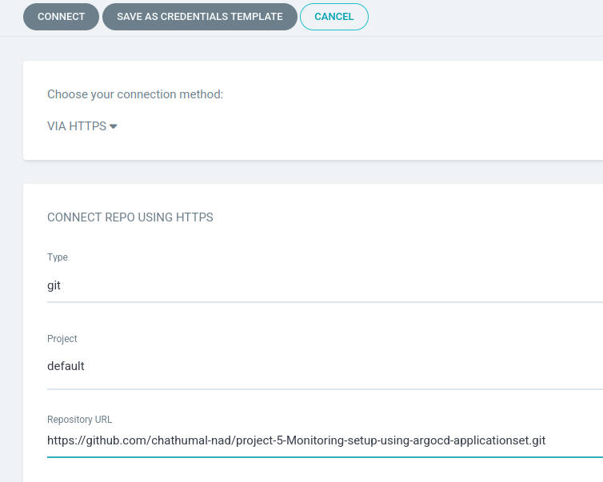

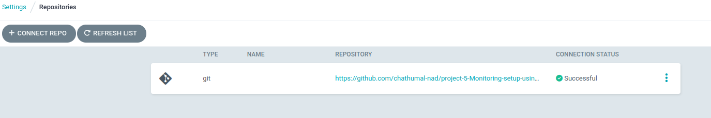

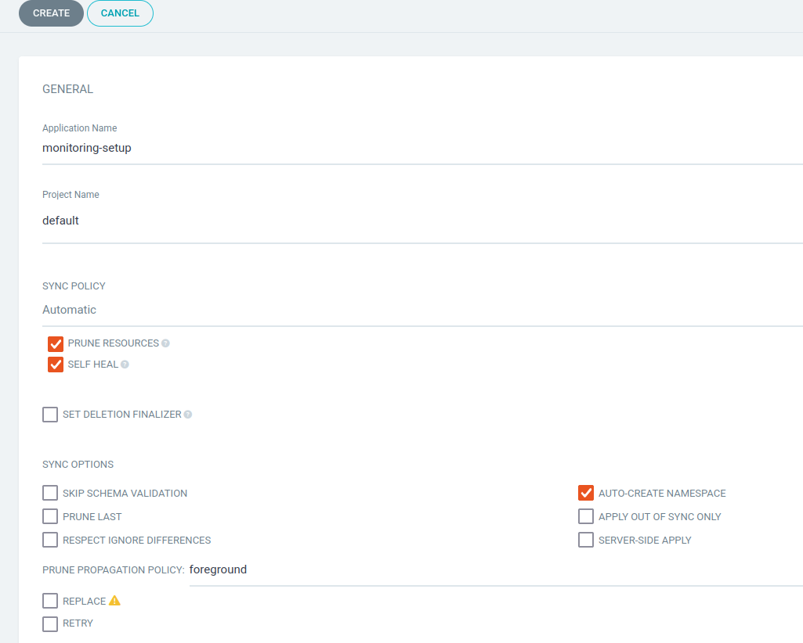

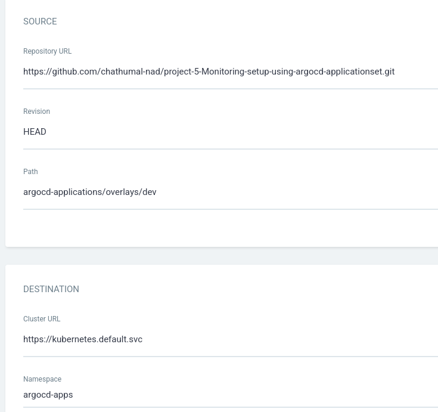

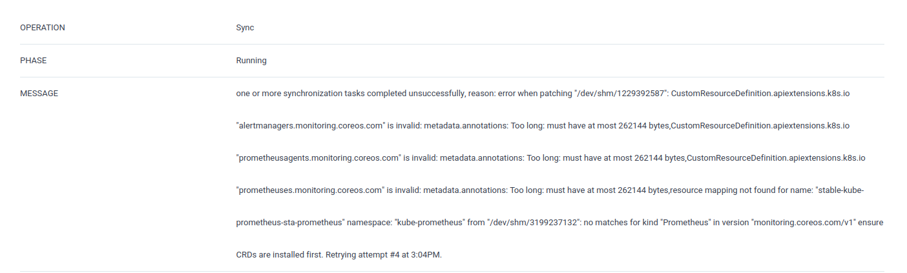

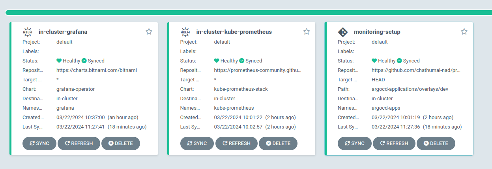

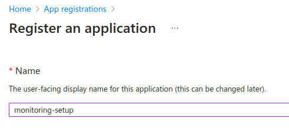

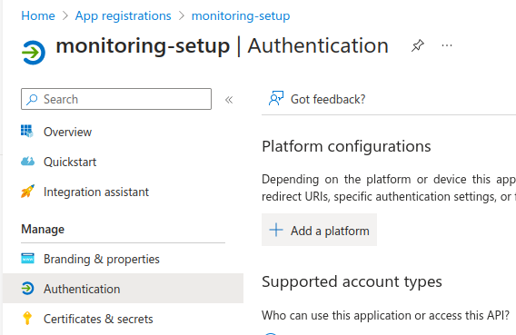

we need a https endpoint so we will go with clusterip and ingress

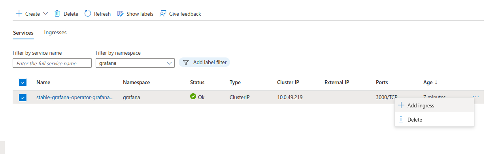

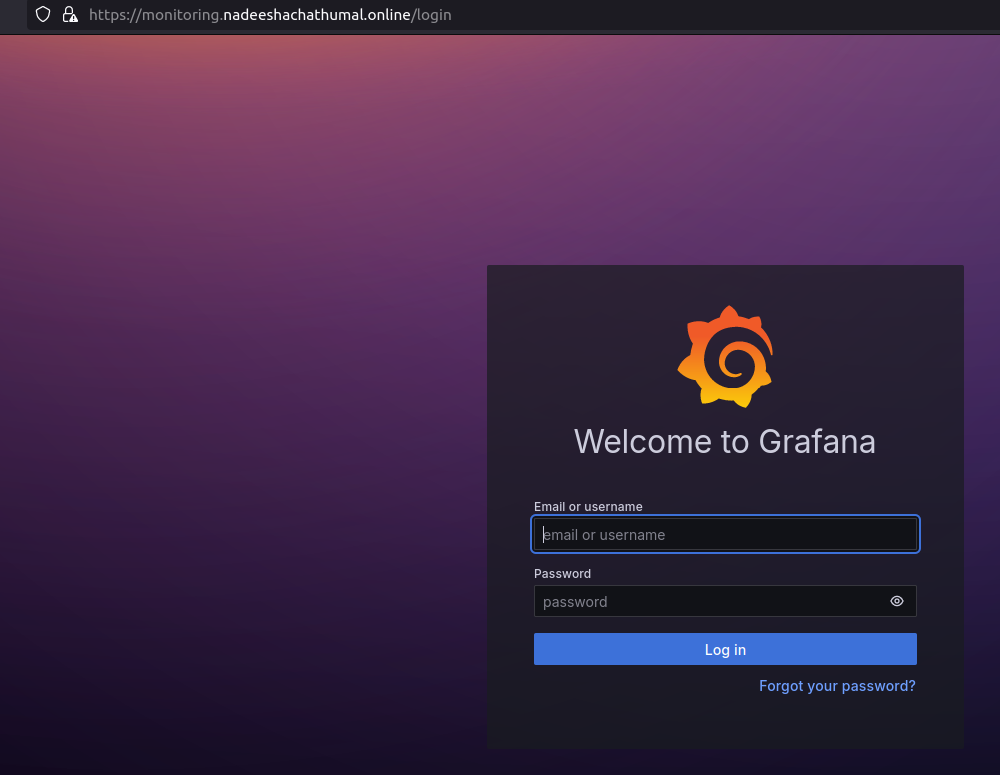

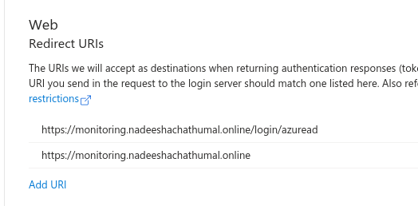

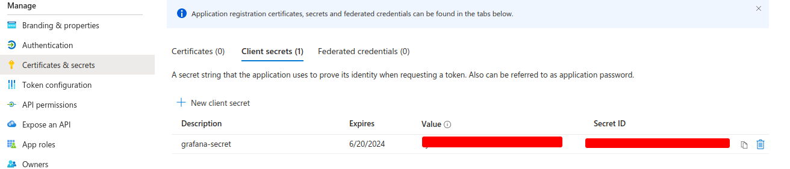

kubectl create secret generic -n grafana grafana-credentials \
  --from-literal=GF_AUTH_AZUREAD_CLIENT_ID=<azuread_client_id_value> \
  --from-literal=GF_AUTH_AZUREAD_CLIENT_SECRET=<azuread_client_secret_value>

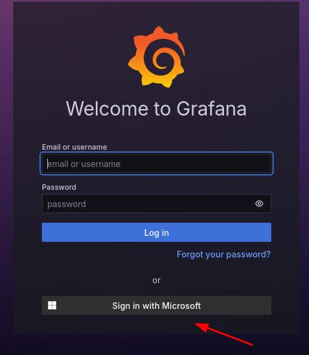

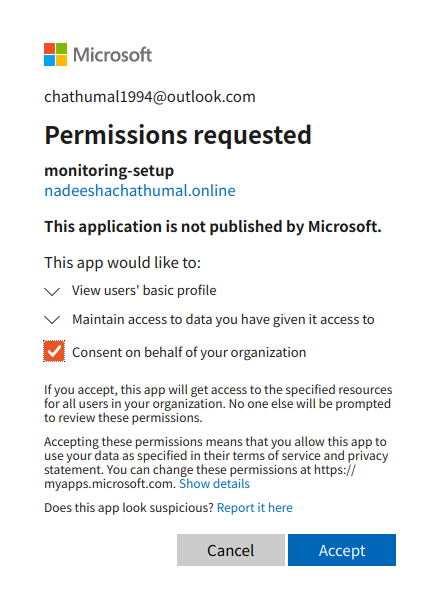

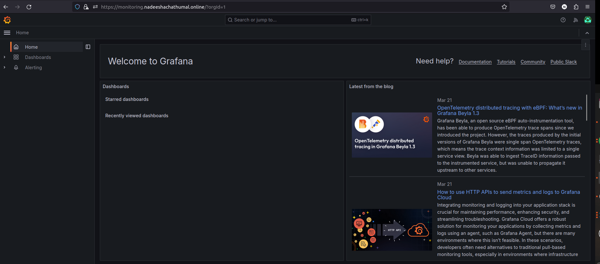

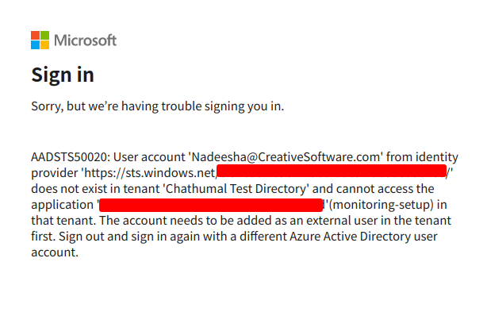

In this way, all the users are accessed for the role 'Viewer' by default.

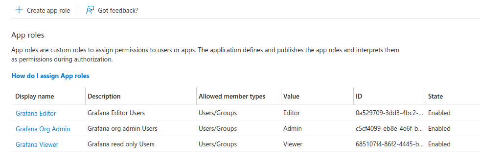

Include the terraform link also

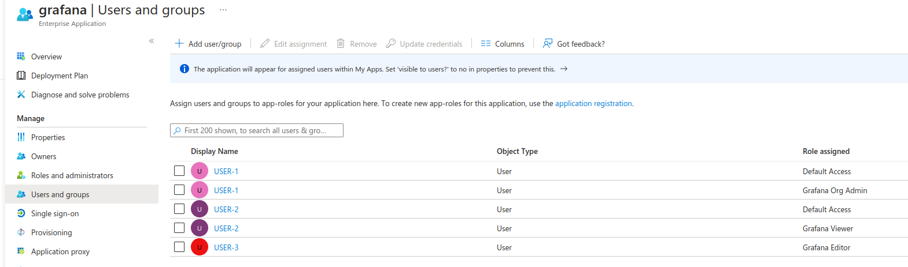

